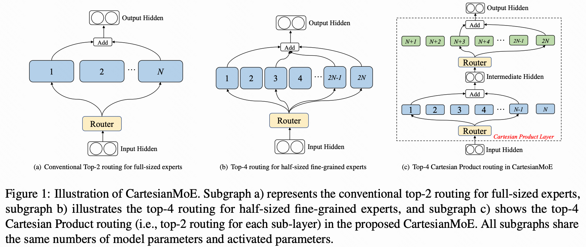
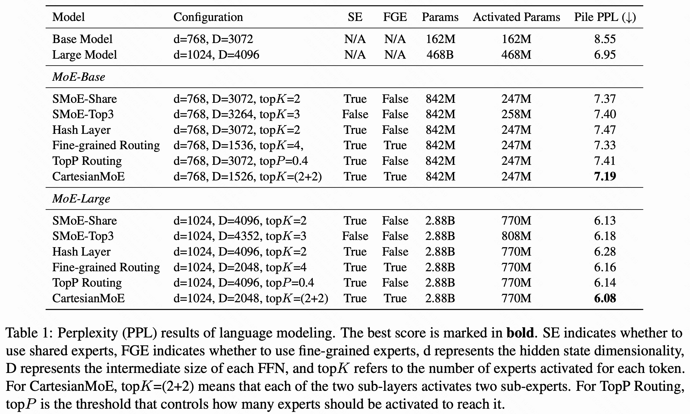
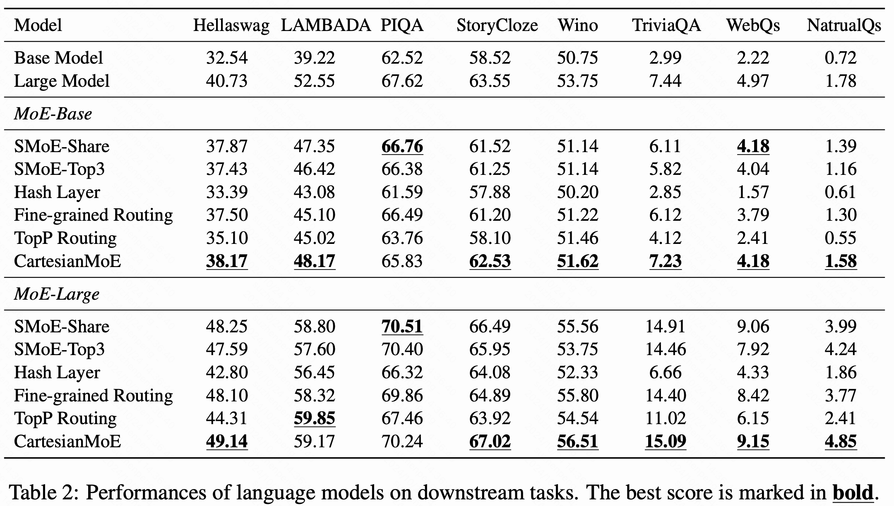
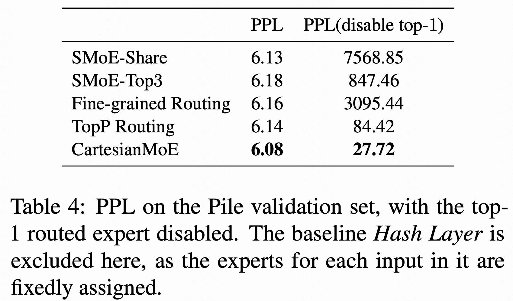
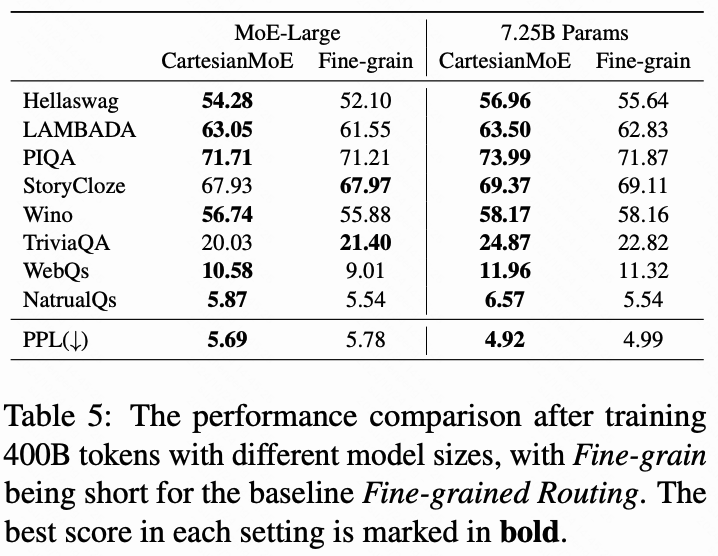
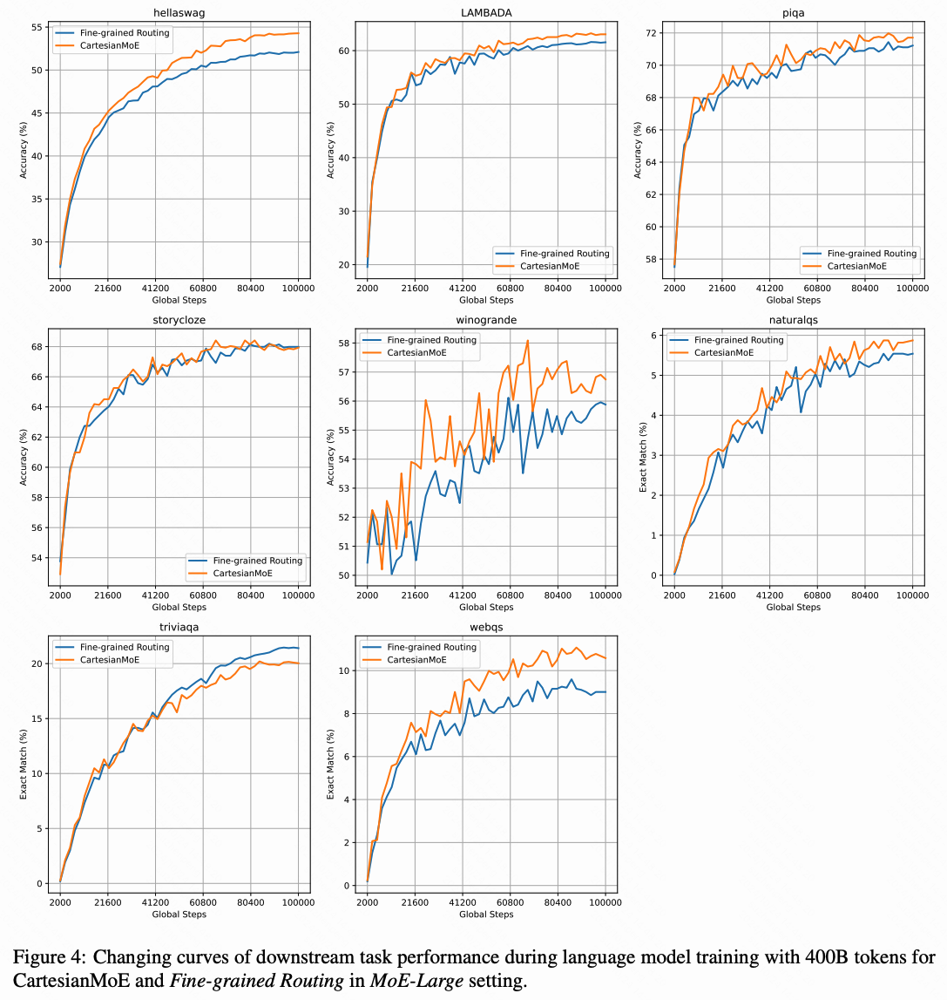
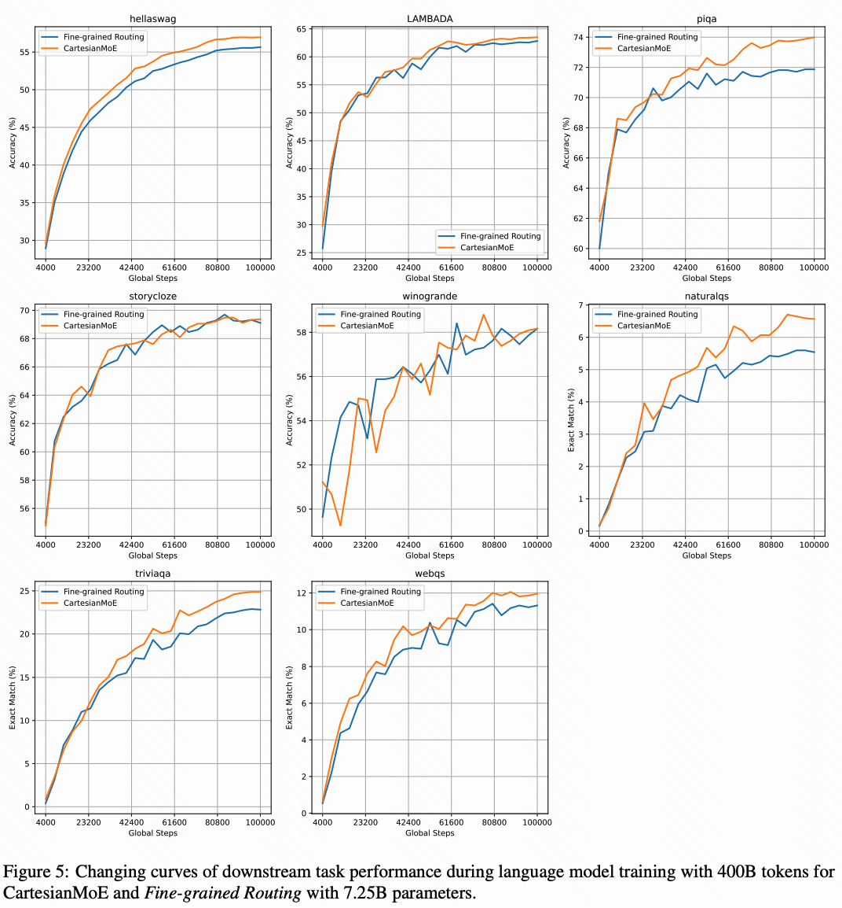

# CartesianMoE：通过笛卡尔积路由策略增强专家知识共享

**作者**：苏振鹏
**机构**：中国科学院信息工程研究所，中国科学院大学
**Arxiv**：[https://arxiv.org/abs/2410.16077](https://arxiv.org/abs/2410.16077)

## 问题背景

近年来，大型语言模型（LLM）因其在下游任务中的优异表现备受关注。尽管扩展LLM可以提高其能力，但计算复杂性也随之增加。专家混合（MoE）模型通过扩大规模而不显著增加成本来缓解这一问题，但MoE模型的专家之间面临知识共享的挑战。为了解决这个问题，先前的工作提出以“相加”的方式实现知识共享，本文受到协同矩阵分解的启发提出了CartesianMoE，通过“相乘”的方式更有效地共享知识，实验结果显示其在困惑度、下游任务性能及路由鲁棒性方面优于现有MoE模型。

## 方法介绍

先前的共享专家的方式常通过“相加”的方式实现。例如，有一个共享专家$FFN_{a}$，和几个可路由专家 $FFN_{b}，FFN_{c}，FFN_{d}$，专家的知识共享可以表示为 $FFN_{a}+FFN_{b}$，$FFN_{a}+FFN_{c}$，$FFN_{a}+FFN_{d}$。
受到协同矩阵分解的启发， 我们提出通过“相乘”的方式实现专家的知识共享，即 $FFN_{a} \cdot FFN_{b}$，$FFN_{a} \cdot FFN_{c}$，$FFN_{a} \cdot FFN_{d}$。实现上，定义两个MoE子专家集合，$FFN_{a}^{1}, FFN_{b}^{1}, \ldots$ 和 $FFN_{a}^{2}, FFN_{b}^{2}, \ldots$。我们将每个专家设计为分别来自上述两个集合的子专家组合。例如，$FFN_{aa} = FFN_{a}^1 \cdot FFN_{a}^2$ 或 $FFN_{ab} = FFN_{a}^1 \cdot FFN_{b}^2$。换言之，所有专家都可以通过两个子专家集合的笛卡尔积来导出，因此该方法称之为CartesianMoE。具体来说，CartesianMoE将传统的MoE层替换为一个笛卡尔积层，如图1所示，该层由两个顺序的MoE子层组成，每个子层表示一组子专家，且每个MoE子层都具有各自的router。

  

## 实验结果

### 主要实验结果和分析

我们分别评估了CartesianMoE和其它MoE模型，在Pile验证集的PPL和在常用benchmarks的性能。如表1和表2所示，在MoE-Base和MoE-Large两个设置下，CartesianMoE不仅能在Pile验证集上具有更低的PPL，在benchmarks上的表现也同样亮眼。我们认为，CartesianMoE的优势来自于其专家之间更细粒度的知识共享。具体来说，“相加”的方式是通过一个固定激活的专家，实现对全局的知识共享，相比之下，CartesianMoE将专家分成小组，允许每个小组共享一些组内知识。例如专家FFN$_{aa}$ 和 FFN$_{ab}$可以实现对子专家 FFN$_{a}^{1}$的知识共享，类似的专家FFN$_{ba}$ 和 FFN$_{bb}$可以实现对子专家FFN$_{b}^{1}$的共享。值得注意的是，CartesianMoE也装备了“相加”的方式的共享专家，以实现一个“全局知识共享+分组知识共享”的MoE系统。
  

### 移除全局共享专家

如表3所示，在移除全局共享专家的情况下，CartesianMoE的表现仍然优于全局的共享专家方式（表中Fine-grained Routing）。这证明了按组的知识共享与全局知识共享同等重要。同时具有分组知识共享以及全局共享专家的模型是最好的，这证明了“全局知识共享+分组知识共享”MoE系统的有效性。  

### 路由鲁棒性分析
我们在Pile验证集上，禁用每个token的最高路由概率专家，然后从剩余专家中选择前K个专家，评估由此带来的PPL（困惑度）变化。如表4所示，即使禁用最高路由概率专家，CartesianMoE仍表现出最低的PPL。由此可以见，CartesianMoE具有更强的路由鲁棒性。  

### 使用更多的算力训练模型

上述的实验仅用100B Tokens训练了最大2.88B总参数的MoE-Large模型。为了探索CartesianMoE在更多训练算力下的性能。在该节，分别在MoE-Large和一个总参数量7.25B，激活参数1.61B的更大尺度模型上进行训练，训练的总Tokens量为400B。如表5所示，使用更多的算力训练模型，CartesianMoE仍然得益于Fine-grained Routing策略。该实验结果进一步证明了CartesianMoE的优越性和可扩展性。  

我们还在图2和图3进一步给出了整个预训练过程中模型在benchmarks上的性能，在大部分benchmarks上，CartesianMoE始终表现出了更强的性能。  
  
